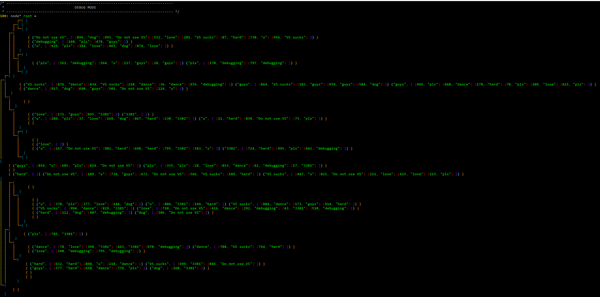

# Examples

## basic.cpp

This is the most basic of all the examples. 

Like all the other projects using this library, it is based on the `template.cpp`. The first 26 lines are just that and don't have anything special about them.

Then we define all of our test variables and call `watch()` on them afterwards. _simple_

### Linux

### Windows

## structs.cpp

Similarly to `basic.cpp` it's based on `template.cpp` and has the fancy things in its beginning.

In order for cupl to properly handle your struct, you have to provide it with information about your struct members.

To do this, you can use the `declare_struct(...)` function and put all the member names you want to print instead of the three dots. 

### Linux

### Windows

## math.cpp

This example show that you can debug arithmetic operations with this library.

It implements the Fourier series approximation and calculates it for some random values.

### Linux

### Windows

## trees.cpp

This example shows the possibilities of printing binary trees. 

The first 27 lines are just `template.cpp` and there is nothing special to tell about them.

#### Binary tree in array (a)

Here is the most basic binary tree without anything fancy.
We `watch()` this example starting in two different roots.

#### Binary tree in array (b)

This example shows that a binary tree can be used with all types of data, including multi-dimensional structures.

#### Binary tree in array (c)

Here we can see that you can print binary trees with mixed data types and structures.

#### Binary tree in array (d)

This is an exposition of the true power of this library. For example, we can mirror the tree without adding anything.

#### Binary tree in array (e)

Here we print a tree without the left subtree.

#### Binary tree in array (f)

Lambdas will work at some point, I promise.

#### Binary tree in adjacency matrix (a)

Here we construct functions for other methods of representing binary trees.

### Linux

### Windows

## graph.cpp

To be seen!

## extreme.cpp

I don't think there is much to be said about this one. It is completely unrealistic and only shows how much potential this library has.

It may look pretty bad on some terminals but is definitely worth checking out.

_enjoy at your own risk_

### Linux

### Windows

## random.cpp

This is some random stuff we didn't want to delete because it has sentimental value for us.

### Linux

### Windows

