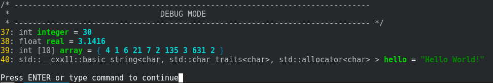
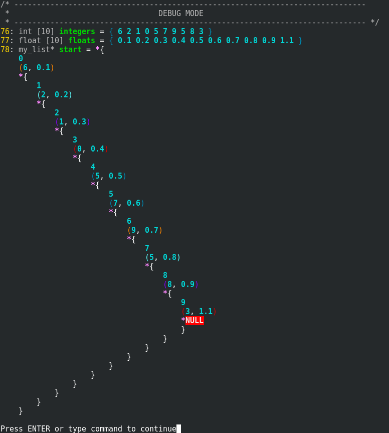

# Examples

## basic.cpp

This is the most basic of all the examples. 

Like all the other projects using this library, it is based on the `template.cpp`. The first 26 lines are just that and don't have anything special about them.

Then we define all our test variables and call `watch()` on them afterwards. _simple_

### Linux

## structs.cpp

This is a far more complex example.

Similarly to `basic.cpp` it's based on `template.cpp` and has the fancy things in its beginning.

This time though we have a struct with a special `print_process` method to allow our library to process it correctly.

This function first prints a '{' sign, then tells the library that the content should be indented from this point.

After that it prints all the members of the structure (using `cupl::print_process` to support all the types), followed by endlines and `cupl::indentation` to make the indentation look correctly.

Finally it informs the library that the content should no longer be indented and prints the closing '}'.

Then in the `int main()` it builds the custom list and calls `watch()` on its first element. _profit_

### Linux

## math.cpp

_WIP_

## trees.cpp

_WIP_

## graph.cpp

To be seen!

## extreme.cpp

I don't think there is much to be said about this one. It is completely unrealistic and only shows how much potential this library has.

It may look pretty bad on some terminals but is definitely worth checking out.

_enjoy at your own risk_
